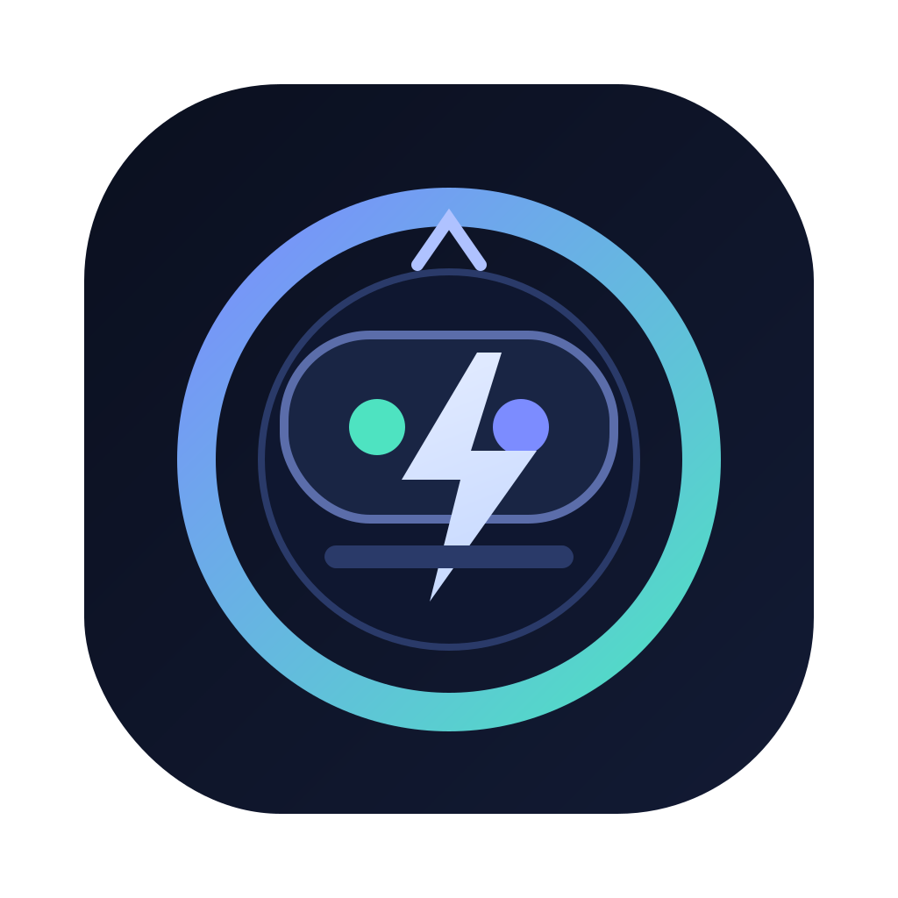
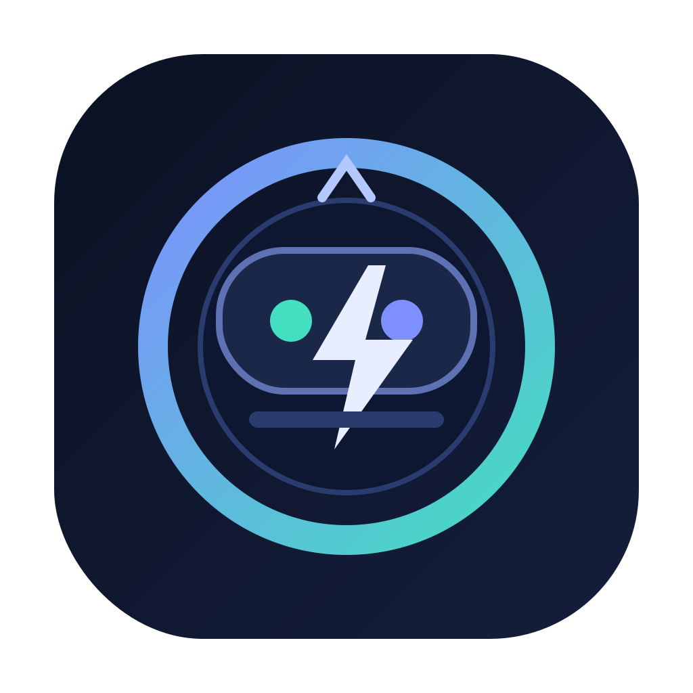
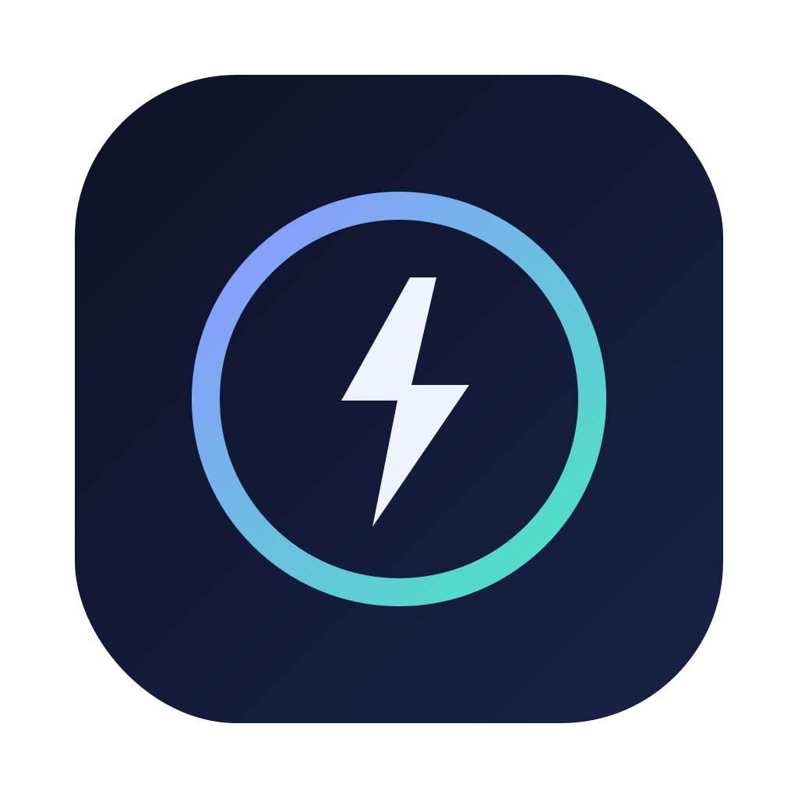
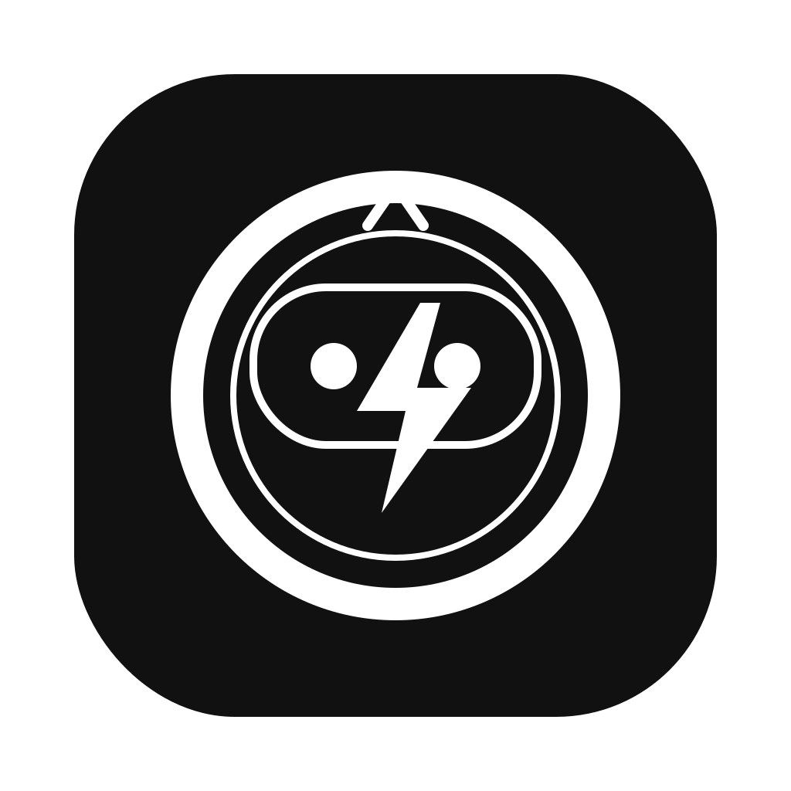
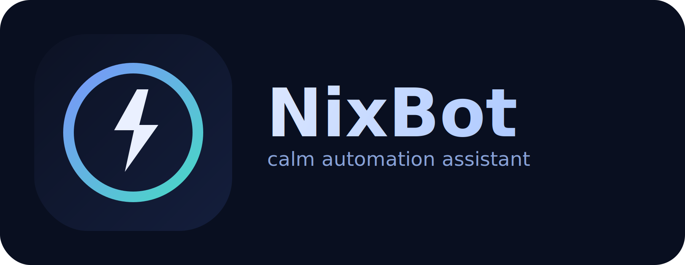

# NixBot Branding

## Logo files

- `nixbot-logo.svg` — original concept mark
- `nixbot-mark-core.svg` — primary avatar/logo mark
- `nixbot-mark-minimal.svg` — simplified mark for small sizes
- `nixbot-mark-mono.svg` — monochrome variant for print/high-contrast use
- `nixbot-lockup-horizontal.svg` — icon + wordmark lockup for banners/docs

## SVG previews

### nixbot-logo.svg

### nixbot-mark-core.svg

### nixbot-mark-minimal.svg

### nixbot-mark-mono.svg

### nixbot-lockup-horizontal.svg

## Recommended usage

- **GitHub profile avatar:** `nixbot-mark-core.svg` (or `nixbot-mark-minimal.svg` if tiny)
- **README headers / social cards:** `nixbot-lockup-horizontal.svg`
- **One-color environments:** `nixbot-mark-mono.svg`

## Notes

- Style: calm, modern, assistant/automation vibe
- Colors: deep navy base with blue/teal accents
- Symbolism: circular badge (stability) + bolt mark (action/automation)

Tip: export 1024x1024 PNG for avatars and 1800x700 PNG for banner-like placements.
